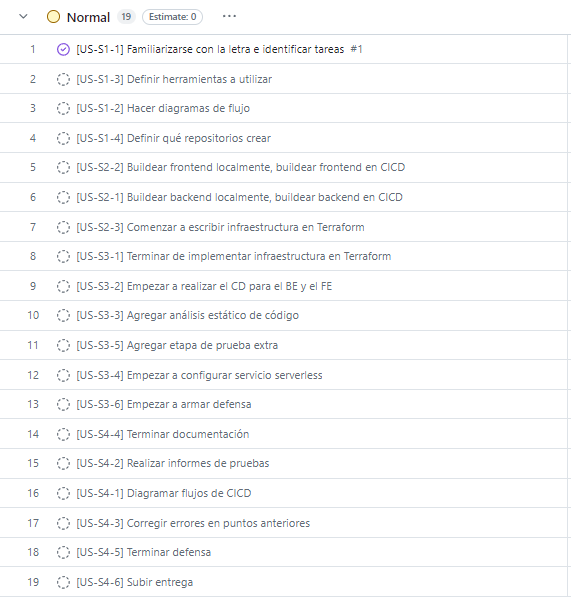
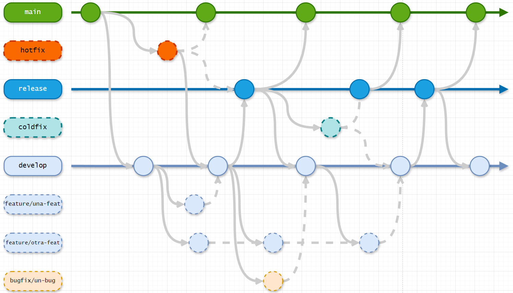

<div style="text-align: center;">
    <h1>Universidad ORT Uruguay</h1>
    <h3>Facultad de Ingeniería</h3>
    <h3>Documentación de obligatorio</h3>
    <h3>Certificado en DevOps</h3>
    <h3>Estudiantes grupo 4: Thiago Schreck - Ezequiel Introini</h3>
    <h3>Tutor: Federico Barceló 2024</h3>
</div>

## Presentación del problema
Una empresa del sector retail desea modernizar la forma en que desarrollan y realizan el delivery del
software de su plataforma. Para esto, uno de sus "C-Levels" propone impulsar un modelo DevOps con el fin
de mejorar el time-to-market y calidad del software desarrollado in-house. Se ha conformado un equipo de
trabajo multidisciplinario con la tarea de promover y llevar a cabo este proceso de modernización a las
áreas de desarrollo, calidad y operación. Además, la empresa tiene interés en explorar estrategias de
automatización y escalabilidad para el despliegue de sus aplicaciones.

## Objetivos
El objetivo principal de este trabajo está basado en aplicar todas las practicas, conocimientos y herramientas que se fueron dictando en lo que transcurrió del curso para implementar un flujo de desarrollo y despliegue continuo (CI / CD) para el empaquetado de FE y las 4 aplicaciones BE. Para esto el equipo va a contar un tablero de Kanban organizado por tareas para poder realizarles un mejor seguimiento, se busca desarrollar una infraestructura en la nube pública (AWS) utilizando IaC y un ciclo completo de integración continua y despliegue continuo (CI / CD). Además se buscará utilizar una herramienta de análisis de código estático en la cual se generará un informe pudiendo así tener información más detallada, identificando posibles problemas y/o mejoras que puedan servir para el código fuente de cara a futuro. También se relizarán pruebas extras a la aplicación de FE o las 4 aplicaciones de BE que pueden incluir pruebas de carga, pruebas automatizadas con herramientas como Postman y se registran los resultados para evaluar el rendimiento de la misma.

## Propuesta
Nuestra propuesta promueve un cambio efectivo en la forma de trabajo actual hacia un modelo basado en DevOps. Este modelo implementa una serie de prácticas, herramientas y metodologías con el objetivo de reducir el time-to-market y mejorar la calidad del software desarrollado internamente.

## Organización de tareas
Para este punto que consideramos vital para el inicio de nuestro proyecto, nos basamos en un tablero Kanban que nos provee la herramienta de Git. Gracias a esto pudimos obtener más claridad en cuanto a las tareas que se iban a realizar por Sprint y el tiempo que llevaría cada una de ellas.

Las tareas que se definieron son las siguientes:
<p align="center">

</p>

## Infraestructura 
Para la infraestructura se logró una modernización que destaca por adoptar un enfoque basado en microservicios, esta arquitectura nos permite un escalado mucho más eficiente tanto de forma vertical como horizontal. También se migró hacia una infraestructura en la nube, utilizando Terraform como principal herramienta para implementar una gestión de IaC (Infraestructure as Code) y además haciendo uso de los servicios que provee AWS.

## Manejo de los repositorios y estrategias de ramas
Para la solución del proyecto se implementaron dos tipos de repositorio

- **Repositorios de los microservicios:** Este repositorio es el que contiene el desarrollo de los microservicios y los archivos que forman el ciclo de Integración Continua. La estrategia elegida para los microservicios fue GitFlow en el cual nos basamos en 3 ramas estables (main - develop - release).
<p align="center">

</p>

- **Repositorios de devops:** Este repositorio es el que contiene los archivos del código que genera la infraestructura y también los que están relacionados al ciclo de Continuous Deployment (CD). En este caso especifico el equipo optó por utilizar una estrategia Trunk Based en la cual mantenemos una única rama estable (main) y ramas a demanda.
<p align="center">

</p>

## Etapas de CI/CD

### Análisis de código estático
Para embarcar la etapa de Integración Continua el equipo decidió integrar la herramienta SonarCloud la cual nos provee de un análisis que se ejecuta cuando se realizan cambios en las ramas y quieren ser integrados a una de las ramas estables que poseemos.
<p align="center">

</p>

### Análisis de los resultados obtenidos
En la mayoría de los repositorios el análisis arrojó el resultado de "PASSED" al test que realizó la herramienta de SonarCloud aunque en parte también se vieron reflejados resultados de tipo "code smells". Esto no significa que el escaneo no haya sido bueno, sino que es una recomendación por parte de la herramienta hacer enfasís en estos "smells" para poder mejorar el código fuente.

A continuación se presenta un ejemplo de los escaneos corridos:

#### shipping-service-example
<p align="center">

</p>

## Prueba extra con Postman
El equipo realizó una etapa de prueba extra como demandaba la letra del proyecto, utilizando Postman para las aplicaciones de backend. Se utilizó la colección "MonolithToMicroservicesExample" proveeida por el docente en el repositorio del curso <b>"T04 - Arquitectura y Microservicios/Obligatorias/01-MonolithToMicroservices/MonolithToMicroservicesExample.postman_collection.json"</b>

En estas pruebas el equipo validó que el tipo de contenido sea el esperado, también que el tiempo de respuesta sea menor a 500ms y tanto el body cómo el código sean los que esperamos. Además se validó que cada respuesta contenga sus campos requeridos (este test varía según el endpoint al que se hace la llamada).

A continuación les dejo los tests realizados más en detalle:

```
### Test realizados al GET de Productos: "/products/123"

// La respuesta debe tener el tipo de contenido correcto
pm.test("Response must have the correct Content-Type", () => {
    pm.response.to.have.header("Content-Type");
});

// La respuesta devuelve 200
pm.test("Status code is 200", function () {
    pm.response.to.have.status(200);
});

// El tiempo de respuesta es menor a 500ms
pm.test("Response time is less than 500ms", function () {
    pm.expect(pm.response.responseTime).to.be.below(500);
});

// La respuesta tiene los campos requeridos
pm.test("Response contains required fields", function () {
    var jsonData = pm.response.json();
    pm.expect(jsonData).to.include.keys('id', 'name', 'stock', "description");
});

// La respuesta es correcta - codigo 200 y body
pm.test("Rsponse must be correct", ()=>{
    pm.response.to.be.ok; 
    pm.response.to.be.withBody;
})
```